---
export_on_save:
  html: true
---

<style>
.katex-display { overflow: auto hidden; padding: 2px }
p.dot { display: flex; justify-content: center; }
img {display: block; margin: 0 auto;}
</style>

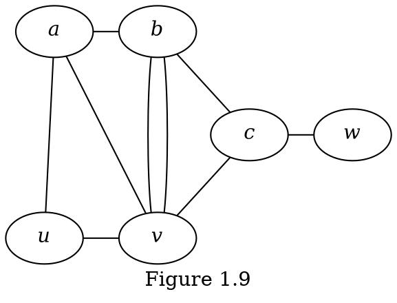

**Question 1.3.1**
(i) Find the degree of each vertex in $G$ of Figure 1.9.
(ii) Find $N(x)$ for each vertex $x$ in $G$ of Figure 1.9.
(iii) By definition, is it true that $d(v) = |N(v)|$?

**Solution**
(i)

$$
d(a) = 3 \\
d(b) = 4 \\
d(c) = 3 \\
d(u) = 2 \\
d(v) = 5 \\
d(w) = 1
$$

(ii)

$$
N(a) = \{u, v, b\} \\
N(b) = \{a, v, c\} \\
N(c) = \{b, v, w\} \\
N(u) = \{a, v\} \\
N(v) = \{a, b, c, u\} \\
N(w) = \{c\}
$$

(iii) It is not always true that $d(v) = |N(v)|$. For example $d(v) = 5$ but $|N(v)| = 4$. This happens because of multiple edges- there are two $bv$ edges but because sets don't allow duplications $N(v)$ only contains $b$ once.

---

**Question 1.3.2** &nbsp; Consider the multigraph $G$ of Figure 1.9. Find $e(G)$ and the sum of the degrees of the six vertices. Is the sum twice of $e(G)$?
&nbsp; &nbsp; In general, is the sum of the degrees of the vertices in a multigraph always double its size?

**Solution**
To find $e(G)$ simply label the edges

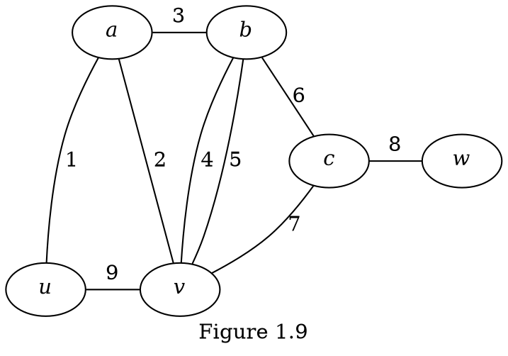

So clearly $e(G) = 9$. Next we find the sum of the degrees of the six vertices.

$$
\begin{aligned}
\sum_{v \in V(G)} d(v) &= d(a) + d(b) + d(c) + d(u) + d(v) + d(w)  \\
&= 3 + 4 + 3 + 2 + 5 + 1 = 18
\end{aligned}
$$

Here we have $\sum_{v \in V(G)} d(v) = 2 e(G)$ and by the Handshaking Lemma this holds in general.

---

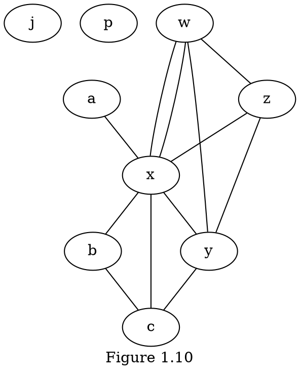

**Question 1.3.3** &nbsp; &nbsp; (1) How many odd vertices are there in each of the multigraphs in the previous examples?
(2) Can you construct a multigraph containing
&nbsp; &nbsp; (i) exactly one odd vertex?
&nbsp; &nbsp; (ii) exactly three odd vertices?

**Solution**

(1) First let's take a look at Figure 1.10 and plot the vertices and their respective degrees:

| Vertex | Degree |
| ------ | ------ |
| $a$    | 1      |
| $b$    | 2      |
| $c$    | 3      |
| $j$    | 0      |
| $p$    | 0      |
| $w$    | 4      |
| $x$    | 7      |
| $y$    | 4      |
| $z$    | 3      |

We can see from this table that four vertices, $a$, $c$, $x$, and $z$, have odd degree.

Next let's take a look at Figure 1.9, pictured again here


Let's make a table of the vertices and their degrees

| Vertex | Degree |
| ------ | ------ |
| $a$    | 3      |
| $b$    | 4      |
| $c$    | 3      |
| $u$    | 2      |
| $v$    | 5      |
| $w$    | 1      |

We can see from this table that four vertices, $a$, $c$, $v$, and $w$, have odd degree.

(2) No for both (i) and (ii) because one and three are odd numbers, and you must have an even number of vertices with odd degree.

---

**Question 1.3.4.** &nbsp; &nbsp; Construct a $5$-regular graph of order $10$. What is its size?

**Solution**

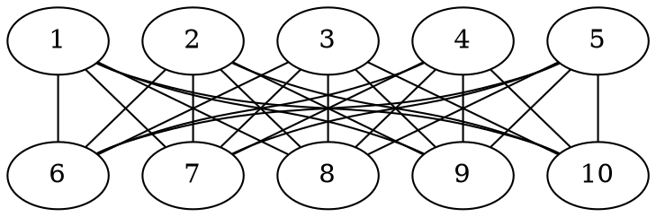

Of course its size is $50$ because it has $10$ nodes each of which is incident with $5$ edges.

---

Among the (simple) graphs $G$ of a fixed order $n$, at one extreme, the null graph $N_n$ contains no edges (the least possible size). At the other extreme, we may ask:

**Question 1.3.5.** &nbsp; &nbsp; What is the largest possible size that $G$ can have? Which graph has its size attaining this largest possible number?

**Solution**

The largest possible size that $G$ can have is $n + (n-1) + \cdot + 0 = \frac{n(n-1)}{2}$, which happens when each vertex is adjacent to every other vertex.

---

## Exercise 1.3

$(1) \>$ In the following multigraph $G$, find
$\quad (i) \>$ the size of $G$,
$\quad (ii) \>$ the degree of each vertex,
$\quad (iii) \>$ the sum $\sum \{ d(v) | v \in V(G) \}$,
$\quad (iv) \>$ the number of odd vertices,
$\quad (v) \>$ $\Delta(G)$, and
$\quad (vi) \>$ $\delta(G)$.

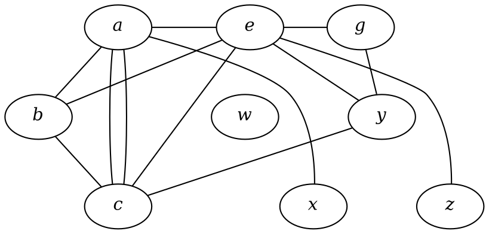

Is your answer for $(iii)$ double your answer for $(i)$? Is your answer for $(iv)$ an even number?

**Solution**

$(i) \>$ To find the size of $G$ we count all the edges

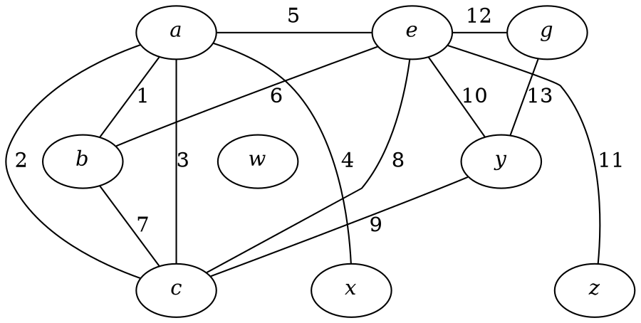

Clearly $e(G) = 13$.

$(ii) \>$ Let's make a table to see the degree of each vertex

| Vertex | Degree |
| ------ | ------ |
| $a$    | 5      |
| $b$    | 3      |
| $c$    | 5      |
| $e$    | 6      |
| $g$    | 2      |
| $w$    | 0      |
| $x$    | 1      |
| $y$    | 3      |
| $z$    | 1      |

$(iii) \>$ Simply add the degree column to get the sum of the degrees

$$
5 + 3 + 5 + 6 + 2 + 0 + 1 + 3 + 1 = 26
$$

$(iv) \>$ The odd vertices are $a$, $b$, $c$, $x$, $y$, $z$, so there are $6$ odd vertices.

$(v) \>$ The highest degree vertex is $e$ with a degree of $6$ so $\Delta(G) = 6$.

$(vi) \>$ The lowest degree vertex is $w$ with a degree of $0$ so $\delta(G) = 0$.

The answer to $(iii)$ is double the answer of $(i)$ and the answer for $(iv)$ is an even number.

---

$(2) \>$ Construct a multigraph of order $6$ and size $7$ in which every vertex is odd.

**Solution**

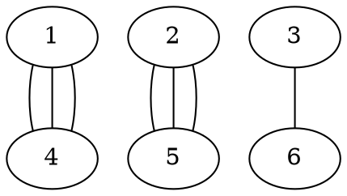

---

$(3) \>$ Let $G$ be a multigraph with $V(G) = \{v_1, v_2, \cdots, v_n\}$. Prove that the sum of all the entries in the $i$th row of the adjacency matrix $A(G)$ is the degree of the vertex $v_i$ for each $i = 1, 2, \cdots, n$.

**Solution**

$$
\sum_{j=1}^n a_{i,j} = \sum_{j=1}^n \text{\# edges joining } v_i \text{ and } v_j = d(v_i)
$$

---

$(4) \>$ Let $G$ be a graph of order $8$ and size $15$ in which each vertex is of degree $3$ or $5$. How many vertices of degree $5$ does $G$ have? Construct one such graph $G$.

**Solution**
Here is one such graph

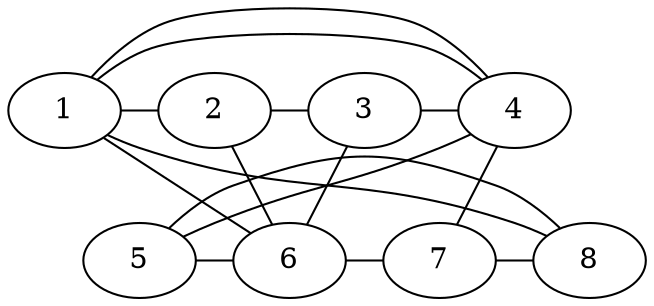

We can check that it is size $15$ by counting the edges

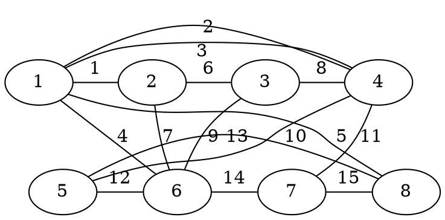

or by observing that the adjacency matrix is

$$
A(G) = \begin{pmatrix}
    0 & 1 & 0 & 2 & 0 & 1 & 0 & 1 \\
    1 & 0 & 1 & 0 & 0 & 1 & 0 & 0 \\
    0 & 1 & 0 & 1 & 0 & 1 & 0 & 0  \\
    2 & 0 & 1 & 0 & 1 & 0 & 1 & 0 \\
    0 & 0 & 0 & 1 & 0 & 1 & 0 & 1 \\
    1 & 1 & 1 & 0 & 1 & 0 & 1 & 0 \\
    0 & 0 & 0 & 1 & 0 & 1 & 0 & 1 \\
    1 & 0 & 0 & 0 & 1 & 0 & 1 & 0 \\
\end{pmatrix}
$$

And so the sum of each row / column is

$$
r_1 = 1 + 2 + 1 + 1 = 5 \\
r_2 = 1 + 1 + 1 = 3 \\
r_3 = 1 + 1 + 1 = 3 \\
r_4 = 2 + 1 + 1 + 1 = 5 \\
r_5 = 1 + 1 + 1 = 3 \\
r_6 = 1 + 1 + 1 + 1 + 1 = 5 \\
r_7 = 1 + 1 + 1 = 3 \\
r_8 = 1 + 1 + 1 = 3
$$

(note that this shows that the degree of each vertex is either $3$ or $5$ as desired)

We can add these up to get

$$
r_1 + r_2 + r_3 + r_4 + r_5 + r_6 + r_7 + r_8 = 5 + 3 + 3 + 5 + 3 + 5 + 3 + 3 = 30
$$

This must be double the number of edges, so we conclude that $e(G) = 15$.

Finally, since $r_1$, $r_4$, and $r_6$ sum up to 5, vertices $1$, $4$, and $6$ have degree five, so our $G$ has $3$ vertices of degree five.

Now, why must all graphs $G$ have $3$ vertices of degree five? Well know that $G$ is of order $8$ and size $15$ so by the Handshaking Lemma

$$
\sum_{i=1}^8 d(v_i) = 2 \times 15 = 30
$$

We also know that each vertex is degree $3$ or $5$. Let $A$ be the set of vertices of degree $3$ and $B$ be the set of vertices with degree $5$. Then

$$
30 = \sum_{v \in A} d(v) + \sum_{v \in B} d(v) = 3 |A| + 5 |B|
$$

Of course since we are order $8$ and every vertex is in $A$ or $B$ but not both so $V(G) = A \sqcup B $, that is the union is disjoint so

$$
|A| + |B| = 8
$$

Plugging in,

$$
30 = 3|A| + 5 (8 - |A|) = 40 - 2 |A| \\
|A| = 5 \\
|B| = 8 - |A| = 3. \quad \square
$$

---

$(5) \>$ Let $H$ be a graph of order $10$ such that $3 \leq d(v) \leq 5$ for each vertex $v$ in $H$. Not every vertex is even. No two odd vertices are of the same degree. What is the size of $H$?

**Solution**
By the Handshaking Lemma we have

$$
\sum_{v \in V(H)} d(v) = 2 e(H)
$$

It would be impossible to have one vertex be degree $3$ and the rest be even because then we would have

$$
2e(H) = 3 + 9 \times 4 = 39
$$

Similarly, it would be impossible to have one vertex be degree $5$ and the rest be even because then we would have

$$
2e(H) = 5 + 9 \times 4 = 41
$$

We conclude that we must have on degree $3$ vertex, one degree $5$ vertex, and that the rest are even. So we calculate that

$$
2 e(H) = 3 + 5 + 8 \times 4 = 40 \\
e(H) = 20. \quad \square
$$

---

$(6) \>$ Let $G$ be a graph of order $14$ and size $30$ in which every vertex is of degree $4$ or $5$. How many vertices of degree $5$ does $G$ have? Construct one such graph $G$.

**Solution**
Let $A$ be the set of vertices that are degree $5$. By the Handshaking Lemma,

$$
\begin{aligned}
2 \times 30 &= \sum_{v \in A} d(v) + \sum_{v \notin A} d(v) = 5 \times |A| + 4 \times (14 - |A|) \\
&= 56 + |A|
\end{aligned} \\
|A| = 4. \quad \square
$$

Here is one such graph

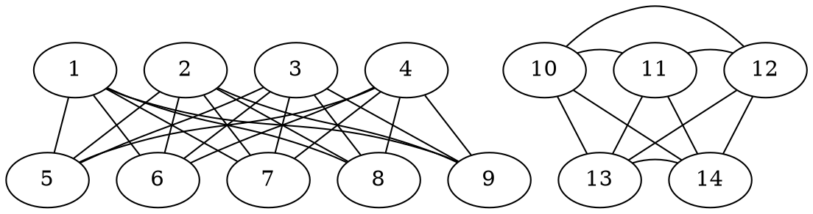

Let's check the degrees of each vertex

| Vertex | Degree |
| ------ | ------ |
| $1$    | 5      |
| $2$    | 5      |
| $3$    | 5      |
| $4$    | 5      |
| $5$    | 4      |
| $6$    | 4      |
| $7$    | 4      |
| $8$    | 4      |
| $9$    | 4      |
| $10$   | 4      |
| $11$   | 4      |
| $12$   | 4      |
| $13$   | 4      |
| $14$   | 4      |

Clearly exactly four vertices are degree $5$ and the rest are degree $4$, and the sum of their degree is $60$, so we know that the size of $G$ is $30$.

---

$(7) \>$ Does there exist a multigraph $G$ of order $8$ such that $\delta(G) = 0$ while $\Delta(G) = 7$? What if "multigraph $G$" is replaced by "graph $G$"?

**Solution**
Here is one such multigraph $G$:

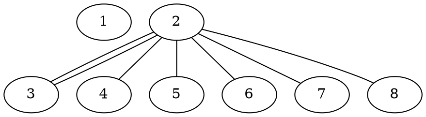

However, no such simple graph can exist. As you can see we need the double edge connection $2$ and $3$ to get the vertex count up to $7$. There are only $8$ total vertices, so if one vertex connects to every other vertex that would be $7$ connections, but it must not connect to one of the vertices because one of the vertices must have degree $0$ because $\delta(G) = 0$. $\quad \square$

---

$(8) \>$ Characterize the 1-regular graphs.

**Solution**

The 1-regular graphs are graphs $G$ such that for every vertex $v \in V(G)$ we have $d(v) = 1$. By the Handshaking Lemma,

$$
\sum_{v \in V(G)} d(v) = 2e(G)
$$

Since $d(v) = 1$ we can simplify this to

$$
2e(G) = v(G)
$$

So all 1-regular graphs have an even number of vertices, and have an edge for every two vertices. Here are some examples of 1-regular graphs.

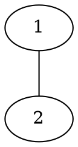

(2 vertices and 1 edge)

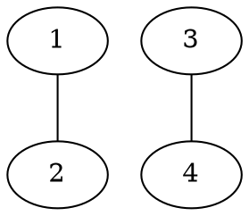

(4 vertices and 2 edges)

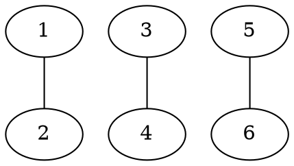

(6 vertices and 3 edges)
etc...

---

$(9) \>$ Draw all regular graphs of order $n$, where $2 \leq n \leq 6$.

**Solution**

When $n = 2$ there are two:

a zero-regular:

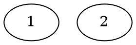

and a $1$-regular:

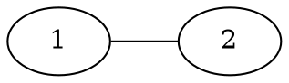

When $n = 3$ are two:

a zero-regular:

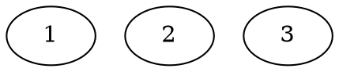

and a $2$-regular:

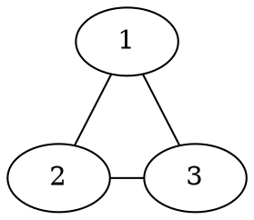

When $n = 4$ there are three:

a zero-regular:

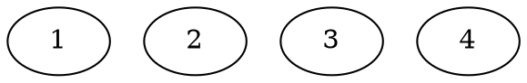

a $1$-regular:

```dot
graph {
    {
        rank = same
        1
        2
    }
    {
        rank = same
        3
        4
    }
    1 -- 3 [style=invis]
    1 -- 2
    3 -- 4
}
```

and a $2$-regular:

```dot
graph {
    {
        rank = same
        1
        2
    }
    {
        rank = same
        4
        3
    }
    4 -- 3
    1 -- 2
    2 -- 3
    4 -- 1
}
```

When $n = 5$ there are two:

a zero-regular:

```dot
graph{
    1
    2
    3
    4
    5
}
```

and a $2$-regular:

```dot
graph {
    1
    {
        rank = same
        2
        5
    }
    {
        rank = same
        4
        3
    }
    5 -- 2 [style=invis]
    1 -- 5
    1 -- 2
    2 -- 3
    4 -- 3
    4 -- 5
}
```

Finally, when $n = 6$ there are four:

a zero-regular:

```dot
graph {
    1
    2
    3
    4
    5
    6
}
```

a $1$-regular:

```dot
graph {
    {
        rank = same
        1
        2
    }
    {
        rank = same
        3
        4
    }
    {
        rank = same
        5
        6
    }
    1 -- 3 [style=invis]
    3 -- 5 [style=invis]
    1 -- 2
    3 -- 4
    5 -- 6
}
```

a $2$-regular:

```dot
graph {
    {
        rank = same
        1
        2
    }
    {
        rank = same
        3
        6
    }
    {
        rank = same
        5
        4
    }
    1 -- 2
    2 -- 3
    3 -- 4
    5 -- 4
    5 -- 6
    6 -- 1
}
```

and a $3$-regular:

```dot
graph {
    rankdir="LR"
    1 -- 4
    1 -- 5
    1 -- 6

    2 -- 4
    2 -- 5
    2 -- 6

    3 -- 4
    3 -- 5
    3 -- 6
}
```

---

$(10) \> (i) \>$ Does there exist a graph $G$ of order $5$ such that $\delta(G) = 1$ and $\Delta(G) = 4$?
$\quad \quad (ii) \>$ Does there exist a graph $G$ of order $5$ which has two vertices of degree $4$ and $\delta(G) = 1$?

**Solution**

$(i) \>$ Yes, as this graph $G$ is order $5$ such that $\delta(G) = 1$ and $\Delta(G) = 4$:

```dot
graph {
    1 -- 2
    1 -- 3
    1 -- 4
    1 -- 5
}
```

$(ii)$ No such graph $G$ of order $5$ which has two vertices of degree $4$ and $\delta(G) = 1$ exists.

Assume such a graph $G$ did exist. Label the two vertices of degree $4$ as $1$ and $2$. It is sufficient to prove that

$$
d(n) \geq 2 \text{ for } n = 3, 4, 5
$$

Let $n = 3, 4, 5$. It is sufficient to prove that the edges $\{1, n\}$ and $\{2, n\}$ exist.

Assume that $\{1, n\} \notin E(G)$. Then $d(1) \leq 3$ (because there are $5$ total vertices, and $1$ can't be connected to itself or $n$), contradicting $d(1) = 4$. Therefore, $\{1, n\} \in E(G)$. We similarly have $\{2, n\} \in E(G)$. $\quad \square$

---

$(11) \>$ Let $H$ be a graph of order $8$ and size $13$ with $\delta(H) = 2$ and $\Delta(H) = 4$. Denote by $n_i$ the number of vertices in $H$ of degree $i$, where $i = 2,3,4$. Assume that $n_3 \geq 1$. Find all possible answers for $(n_2, n_3, n_4)$. For each of your answers, construct a corresponding graph.

**Solution**
Let $A$ be the set of vertices degree $2$, $B$ be the set of vertices degree $3$, and $C$ be the set of vertices degree $4$. Since there are $8$ total vertices and for each vertex $v$ the inequality $\delta(H) \leq d(v) \leq \Delta(H)$ holds, we plug in to get $2 \leq d(v) \leq 4$, or equivalently each vertex $v$ is in $A$, $B$, or $C$. Therefore,

$$
\tag{1} |A| + |B| + |C| = 8.
$$

Applying the Handshaking Lemma gives

$$
\begin{align*}
\sum_{v \in V(H)} d(v) &= 2 e(H) \\
\sum_{v \in A} d(v) + \sum_{v \in B} d(v) + \sum_{v \in C} d(v) &= 2 \times 13 \\
\tag{2} 2|A| + 3|B| + 4|C| &= 26 \\
\end{align*}
$$

Subtracting $(1)$ twice from $(2)$ yields

$$
|B| + 2|C| = 10
$$

since $\delta(H) = 2$, $\Delta(H) = 4$, and $n_3 \geq 1$

$$
6 \geq |A|, |B|, |C|, \geq 1.
$$

So the preliminary pairs of $|B|$ and $|C|$ are:

- $|B| = 1 \implies 2|C| = 9$ which contradicts $|C|$ being a natural number
- $|B| = 2 \implies 2|C| = 8 \implies |C| = 4$
- $|B| = 3 \implies 2|C| = 7$ which contradicts $|C|$ being a natural number
- $|B| = 4 \implies 2|C| = 6 \implies |C| = 3$
- $|B| = 5 \implies 2|C| = 5$ which contradicts $|C|$ being a natural number
- $|B| = 6 \implies 2|C| = 4 \implies |C| = 2 \implies |A| = 0$ which contradicts $\delta(H) = 2$

This leaves us with the possibilities

- $|B| = 2 \text{ and } |C| = 4 \implies |A| = 2$
- $|B| = 4 \text{ and } |C| = 3 \implies |A| = 1$

Or in the form $(n_2, n_3, n_4)$ our possibilities are $(2, 2, 4)$ and $(1, 4, 3)$. $\quad \square$
The following graph is an example of the former.

```dot
graph {
    rankdir="LR"
    {
        rank = same
        1
        2
    }
    {
        rank = same
        3
        4
    }
    {
        rank = same
        5
        6
    }
    {
        rank = same
        7
        8
    }
    1 -- 2 [label=1]
    1 -- 3 [label=2]
    1 -- 4 [label=3]
    1 -- 5 [label=4]

    2 -- 3 [label=5]
    3 -- 4 [label=6]
    4 -- 5 [label=7]

    2 -- 8 [label=8]
    3 -- 8 [label=9]
    5 -- 8 [label=10]

    5 -- 6 [label=11]
    6 -- 7 [label=12]
    7 -- 8 [label=13]
}
```

| Vertex | Degree |
| ------ | ------ |
| 1      | 4      |
| 2      | 3      |
| 3      | 4      |
| 4      | 3      |
| 5      | 4      |
| 6      | 2      |
| 7      | 2      |
| 8      | 4      |

And the following graph is an example of the latter.

```dot
graph {
    rankdir="LR"
    {
        rank = same
        1
        2
    }
    {
        rank = same
        3
        4
    }
    {
        rank = same
        5
        6
    }
    {
        rank = same
        7
        8
    }
    1 -- 2 [label=1]
    1 -- 3 [label=2]
    1 -- 7 [label=3]

    2 -- 3 [label=4]
    2 -- 4 [label=5]
    2 -- 5 [label=6]

    3 -- 4 [label=7]
    3 -- 5 [label=8]

    4 -- 5 [label=9]

    5 -- 6 [label=10]

    6 -- 7 [label=11]
    6 -- 8 [label=12]

    7 -- 8 [label=13]

}
```

| Vertex | Degree |
| ------ | ------ |
| 1      | 3      |
| 2      | 4      |
| 3      | 4      |
| 4      | 3      |
| 5      | 4      |
| 6      | 3      |
| 7      | 3      |
| 8      | 2      |

---

$(12) \>$ Suppose $G$ is a $k$-regular graph of order $n$ and size $m$, where $k \geq 0$, $m \geq 0$ and $n \geq 1$. Find a relation linking $k, n$ and $m$. Justify your answer.

**Solution**

Since $G$ is $k$-regular

$$
d(v) = k \quad \text{for } v \in V(G)
$$

Since $G$ is order $n$

$$
v(G) = |V(G)| = n
$$

Since $G$ is size $m$

$$
e(G) = |E(G)| = m
$$

By the Handshaking Lemma

$$
\sum_{v \in V(G)} d(v) = 2e(G)
$$

Plugging in

$$
\sum_{v \in V(G)} k = 2m \\
nk = 2m. \quad \square
$$

---

$(13) \>$ Does there exist a $3$-regular graph with eight vertices? Does there exist a $3$-regular graph with nine vertices?

**Solution**

One does exist for eight vertices

```dot
graph {
    rankdir="LR"
    1 -- 4
    1 -- 5
    1 -- 6

    2 -- 5
    2 -- 6
    2 -- 7

    3 -- 5
    3 -- 6
    3 -- 8

    4 -- 7
    4 -- 8

    7 -- 8

}
```

However one does not exist for nine vertices. From $(12)$ we know that

$$
nk = 2m
$$

Where $n$ is the order, and $m$ is the size. Plugging in for a $k=3$-regular graph with $n=9$ vertices,

$$
9 \times 3 = 2m
$$

Which can not be true for any integer $m$, contradicting the existence of a $3$-regular graph with $9$ vertices. $\quad \square$

---

$(14) \>$ Construct a cubic graph of order $12$. What is its size? Does there exist a cubic graph of order $11$? Why?

**Solution**

Here is a cubic graph of order $12$

```dot
graph {
    rankdir="LR"
    {
        rank = same
        1
        2
        3
    }
    {
        rank = same
        4
        5
        6
    }
    {
        rank = same
        7
        8
        9
    }
    {
        rank = same
        10
        11
        12
    }
    7 -- 4 [style=invis]

    1 -- 7
    1 -- 8
    1 -- 9
    2 -- 7
    2 -- 8
    2 -- 9
    3 -- 7
    3 -- 8
    3 -- 9

    4 -- 10
    4 -- 11
    4 -- 12
    5 -- 10
    5 -- 11
    5 -- 12
    6 -- 10
    6 -- 11
    6 -- 12
}
```

You can use the formula from $(12)$ to calculate its size

$$
m = \frac{nk}{2} = \frac{12 \times 3}{2} = 18
$$

(or you can just count)

```dot
graph {
    rankdir="LR"
    {
        rank = same
        1
        2
        3
    }
    {
        rank = same
        4
        5
        6
    }
    {
        rank = same
        7
        8
        9
    }
    {
        rank = same
        10
        11
        12
    }
    1 -- 2 -- 3  [style=invis]
    4 -- 5 -- 6  [style=invis]
    7 -- 8 -- 9  [style=invis]
    10 -- 11 -- 12  [style=invis]
    7 -- 4 [style=invis]

    1 -- 7 [label=1]
    1 -- 8 [label=2]
    1 -- 9 [label=3]
    2 -- 7 [label=4]
    2 -- 8 [label=5]
    2 -- 9 [label=6]
    3 -- 7 [label=7]
    3 -- 8 [label=8]
    3 -- 9 [label=9]

    4 -- 10 [label=10]
    4 -- 11 [label=11]
    4 -- 12 [label=12]
    5 -- 10 [label=13]
    5 -- 11 [label=14]
    5 -- 12 [label=15]
    6 -- 10 [label=16]
    6 -- 11 [label=17]
    6 -- 12 [label=18]
}
```

There is no cubic graph of order $11$. To prove it, first assume such a graph did exist. Then

$$
nk = 2m \\
11 \times 3 = 2m
$$

Which is a contradiction. $\quad \square$

---

$(15) \>$ Let $H$ be a $k$-regular graph of order $n$. If $e(H) = 10$, find all possible values for $k$ and $n$; and for each case, construct one such graph $H$.

**Solution**

Let's start with

$$
nk = 2m
$$

Plugging in $m = e(H) = 10$

$$
nk = 20
$$

The preliminary pairs of $n$ and $k$ are

$$
(1, 20), (2, 10), (4, 5), (5, 4), (10, 2), (20, 1)
$$

However we must have $n > k$ so this reduces to

$$
(5, 4), (10, 2), (20, 1)
$$

Let's try these one at a time

- $n = 5$, $k = 4$

```dot
graph {
    rankdir="LR"
    1 -- 2
    1 -- 3
    1 -- 4
    1 -- 5
    2 -- 3
    2 -- 4
    2 -- 5
    3 -- 4
    3 -- 5
    4 -- 5
}
```

- $n = 10$, $k = 2$

```dot
graph {
    {
        rank = same
        1
        10
    }
    {
        rank = same
        2
        9
    }
    {
        rank = same
        3
        8
    }
    {
        rank = same
        4
        7
    }
    {
        rank = same
        5
        6
    }
    1 -- 2 -- 3 -- 4 -- 5 -- 6 -- 7 -- 8 -- 9 -- 10
    1 -- 10
}
```

- $n = 20$, $k = 1$

```dot
graph {
    {
        rank = same
        1
        2
        3
        4
        5
    }
    {
        rank = same
        6
        7
        8
        9
        10
    }
    {
        rank = same
        11
        12
        13
        14
        15
    }
    {
        rank = same
        16
        17
        18
        19
        20
    }
    1 -- 2 -- 3 -- 4 -- 5 [style=invis]
    6 -- 7 -- 8 -- 9 -- 10 [style=invis]
    11 -- 12 -- 13 -- 14 -- 15 [style=invis]
    16 -- 17 -- 18 -- 19 -- 20 [style=invis]
    11 -- 6 [style=invis]
    1 -- 11
    2 -- 12
    3 -- 13
    4 -- 14
    5 -- 15
    6 -- 16
    7 -- 17
    8 -- 18
    9 -- 19
    10 -- 20
}
```

---

$(16) \>$ $(+)$ Let $G$ be a $3$-regular graph with $e(G) = 2v(G) - 3$. Determine the values of $v(G)$ and $e(G)$. Construct all such graphs $G$.

**Solution**

$$
nk = 2m \\
3n = 2(2n - 3) \\
3n = 4n - 6 \\
n = 6 \\
e(G) = 2v(G) - 3 = 2n - 3 = 2 \times 6 - 3 = 9
$$

```dot
graph {
    1 -- 4
    1 -- 5
    1 -- 6
    2 -- 4
    2 -- 5
    2 -- 6
    3 -- 4
    3 -- 5
    3 -- 6
}
```

---

$(17) \>$ Find all integers $n$ such that $100 \leq e(K_n) \leq 200$.

**Solution**

We know that

$$
e(K_n) = \binom{n}{2} = \frac{n!}{2!(n-2)!} = \frac{n(n-1)}{2} \\
100 \leq \frac{n(n-1)}{2} \leq 200 \\
200 \leq n^2 - n \leq 400
$$

Let $f(n) = n^2 - n$. Recall that $n > 0$, so $f'(n) = 2n - 1 > 0$ so $f$ is increasing. Calculate that

$$
14 \times 14 = 14 \times (10 + 4) = 140 + 14 \times 4 = 140 + (10 + 4) \times 4 = 140 + 40 + 16 = 196 \\
196 - 14 = (100 + 96) - 14 = 100 + (96 - 14) = 100 + (90 + 6 - 10 - 4) \\
= 100 + 80 + 6 - 4 = 182 \\
f(14) = 14^2 - 14 = 182 \\
15 \times 15 = 5 \times 3 \times 5 \times 3 = 25 \times 9 = 25 \times 8 + 25 \\
= 25 \times 4 \times 2 + 25 = 100 \times 2 + 25 = 225 \\
225 - 15 = 200 + 25 - 15 = 200 + 10 = 210 \\
f(15) = 15^2 - 15 = 210 \\
16 \times 16 = 8 \times 2 \times 8 \times 2 = 64 \times 4 = 60 \times 4 + 4 \times 4 = 240 + 16 = 256 \\
256 - 16 = 240 \\
f(16) = 16^2 - 16 = 240 \\
17 \times 17 = (10 + 7) \times (10 + 7) = 100 + 70 + 70 + 49 \\
= 100 + 140 + 49 = 100 + 189 = 289 \\
289 - 17 = 200 + 80 + 9 - 10 - 7 = 200 + 80 - 10 + 9 - 7 = 272 \\
f(17) = 17^2 - 17 = 272 \\
18 \times 18 = 9 \times 2 \times 9 \times 2 = 81 \times 4 = 80 \times 4 + 4 = 324 \\
324 - 18 = 300 + 24 - 18 = 306 \\
f(18) = 18^2 - 18 = 306 \\
19 * 19 = (10 + 9) \times 19 = 190 + 9 \times 19 = 190 + 9 \times (10 + 9) \\
= 190 + 90 + 81 = 190 + 90 + 10 + 71 = 290 + 71 = 290 + 10 + 61 \\
= 300 + 61 = 361 \\
19 * 19 - 19 = 361 - 19 = 361 - 20 + 1 = 341 + 1 = 342 \\
f(19) = 19^2 - 19 = 342 \\
20 \times 20 - 20 = 400 - 20 = 380 \\
f(20) = 20^2 - 20 = 380 \\
21 \times 21 = 21 \times 20 + 21 = 420 + 21 = 441 \\
21 \times 21 - 21 = 441 - 21 = 420\\
f(21) = 21 ^ 2 - 21 = 420
$$

Why did I show all the arithmetic there? I don't know I was just having fun with it. Anyways the answer is integers $n$ such that

$$
15 \leq n \leq 20. \quad \square
$$

---

$(18) \>$ $(+)$ Let $G$ be a multigraph of order $13$ in which each vertex is of degree $7$ or $8$. Show that $G$ contains **at least eight** vertices of degree $7$ or **at least seven vertices** of degree $8$.

**Solution**

Let $A$ be the set of vertices degree $7$ and $B$ be the set of vertices degree $8$. Then

$$
|A| + |B| = 13,
$$

If we have

$$
|A| < 8
$$

Then

$$
|B| = 13 - |A| > 5
$$

Our preliminary pairs are

$$
|A| = 7, |B| = 6  \\
|A| = 6, |B| = 7 \\
|A| = 5, |B| = 8 \\
|A| = 4, |B| = 9 \\
|A| = 3, |B| = 10 \\
|A| = 2, |B| = 11 \\
|A| = 1, |B| = 12 \\
|A| = 0, |B| = 13 \\
$$

The only case that would be problematic is

$$
|A| = 7, |B| = 6
$$

so we just have to show that this cant happen. Using the Handshaking Lemma

$$
7|A| + 8|B| = 2e(G) \\
2e(G) = 7 \times 7 + 8 \times 6 = 49 + 48 = 50 - 1 + 50 - 2 = 100 - 3 = 97
$$

This is a contradiction because $97$ is not an even number. $\quad \square$

---

$(19) \>$ $(+)$ Let $G$ be a graph of order $n$ in which there exist **no** three vertices $u$, $v$ and $w$ such that $uv$, $vw$ and $wu$ are all edges in $G$. Show that $n \geq \delta(G) + \Delta(G)$.

**Solution**

Let $N(u)$ be the set of vertices incident to $u$, where $d(u) = \Delta(G)$.
Let $v \in N(u)$. Consider $N(v)$.
If $w \in N(u)$ then we don't have $w \in N(v)$. Since $|N(u)| = \Delta(G)$,

$$
|N(v)| \leq n - \Delta(G)
$$

Since we obviously have

$$
\delta(G) \leq |N(v)|
$$

We plug in to get

$$
\delta(G) \leq n - \Delta(G) \\
n \geq \delta(G) + \Delta(G). \quad \square
$$

---

$(20) \>$ $(+)$ There were $n \> (\geq 2)$ persons at a party and, as usually happens, some shake hands with others. No one shook hands with the same person more than once. Show that there are at least two persons in the party who had the same number of handshakes.

**Solution**
Each person is a vertex and two vertices are connected by an edge if they shook hands, so this is a graph, call it $G$.
Since there are $n \geq 2$ persons, $G$ has order $n$.
We know that for each $v \in V(G)$,

$$
\tag{1}0 \leq d(v) \leq n - 1
$$

Assume that there was a loner, aka someone who shook hands with no one, or in graph-theoretical terms there exists some $v \in V(G)$ such that

$$
d(v) = 0
$$

Since no one shook hands with $v$, Inequality $(1)$ become

$$
0 \leq d(v) \leq n - 2
$$

Since there are $n$ vertices and $n-1$ possibilities for their degrees, by the Pigeonhole Principle at least one of the degrees must be repeated. This pair of vertices with the same degree corresponds to the people in the party with the same number of handshakes.

This solution relied on assuming that there was a loner, that is a vertex $v \in G$ such that $d(v) = 0$. What if there is no loner? Well then Inequality $(1)$ becomes

$$
0 < d(v) \leq n - 1
$$

so we can once again apply the Pigeonhole Principle to achieve the desired result. $\quad \square$

---

$(21) \>$ The preceding problem says that in any graph order $n \geq 2$, there exists two vertices having the same degree. Is the result still valid for multigraphs?

**Solution**

No, see this counterexample.

```dot
graph {
    {
        rank = same
        2
        3
    }
    1 -- 2
    2 -- 3
    2 -- 3
}
```

| Vertex | Degree |
| ------ | ------ |
| 1      | 1      |
| 2      | 3      |
| 3      | 2      |

$\square$

---

$(22) \>$ $(+)$ Mr. and Mrs. Sany attended an exclusive party where in addition to themselves, there were only another $3$ couples. As usually happens, some shake hands with others. No one shook hands with the same person more than once and no one shook hands with his/her spouse. After all the handshakes had been done, Mr. Samy asked each person, including his wife, how many hands he/she had taken. To everyone's amuesement, each one gave a different answer. How many hands did Mrs. Samy shake?

---

$(23) \>$ $(+)$ In the preceding problem, there were four couples altogether in a party. Solve the general problem where 'four couples' is replacy by '$n \> (\geq 2)$ couples'.

---

$(24) \>$ $(+)$ There are $n \geq 2$ distinct points in the plane such that the distance between any $2$ points is at least one. Prove that there are at most $3n$ pairs of these points at distance exactly one.

$$
\\
$$
