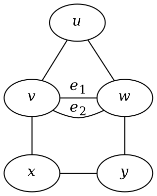
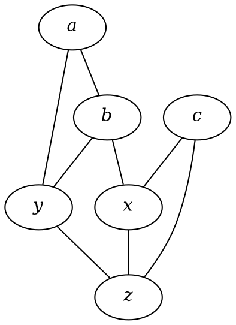
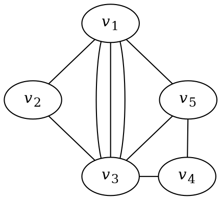
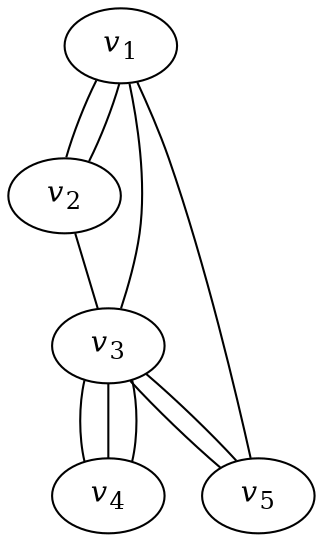
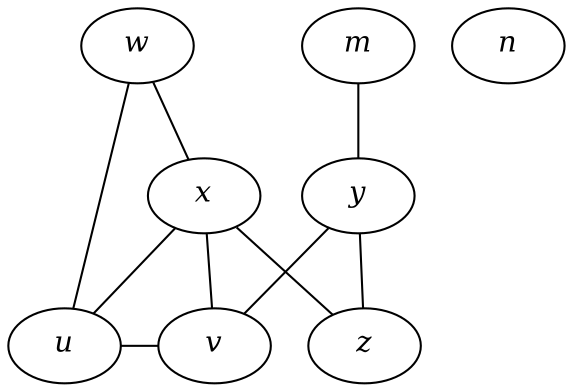

---
export_on_save:
  html: true
---

**Question 1.2.2** Let $G$ be the multigraph shown below. Find $V(G)$, $E(G)$, $v(G)$, and $e(G)$.

**Solution**

$$
V(G) = \{u, v, w, x, y\} \\
E(G) = \{uv, uw, e_1, e_2, vx, wy, xy\} \\
v(G) = 5 \\
e(G) = 7
$$

---

**Question 1.2.3.** Let $H$ be the graph with $V(H) = \{a,b,c,x,y,z\}$ and $E(H) = \{ab, ay, bx, by, cx, cz, xz, yz\}$. Find $v(H)$ and $e(H)$, and draw a diagram of $H$.

**Solution**
$v(H) = 6$
$e(H) = 8$

---

**Question 1.2.4** Let $G$ be the multigraph shown below.

$(i)\>$ Find $A(G)$
$(ii)\>$ Is $A(G)$ symmetric (i.e., $(i,j)$-entry = $(j,i)$=entry)?
$(iii)\>$ What is the sum of the values of the entries in each row (respectively, column)?
$(iv)\>$ What is your interpretation of the 'sum' obtained in $(iii)$?

**Solution**

$(i)$

$$
A(G) = \begin{pmatrix}
0 & 1 & 3 & 0 & 1 \\
1 & 0 & 1 & 0 & 0 \\
3 & 1 & 0 & 1 & 1 \\
0 & 0 & 1 & 0 & 1 \\
1 & 0 & 1 & 1 & 0
\end{pmatrix}
$$

$(ii)\>$ Yes, $A(G)$ is symmetric.
$(iii)\>$ $5, 2, 6, 2, 3$
$(iv)\>$ The sum of the values of the entries in each row corresponds to the total number of edges that vertex is incident with.

---

**Question 1.2.5** The adjacency matrix of a multigraph $G$ is given below:

$$
A = \begin{pmatrix}
    0 & 2 & 1 & 0 & 1 \\
    2 & 0 & 1 & 0 & 0 \\
    1 & 1 & 0 & 3 & 2 \\
    0 & 0 & 3 & 0 & 0 \\
    1 & 0 & 2 & 0 & 0 \\
\end{pmatrix}
$$

Draw a diagram of $G$
**Solution**

---

## **Exercise 1.2**

(1) Let $G$ be the multigraph representing the following diagram. Determine $V(G)$, $E(G)$, $v(G)$, and $e(G)$. Is $G$ a simple graph?

$$
V(G) = \{w, m, n, x, y, u, v, z\} \\
E(G) = \{ wu, wx, my, xu, xv, xz, yv, yz, uv \} \\
v(G) = 8\\
e(G) = 9
$$

---

(2) Draw the graph $G$ modeling the flight connectivity between twelve capital cities with the following vertex set $V(G)$ and edge set $E(G)$.

$$
\begin{aligned}
V(G) = &\{ \text{Asuncion}, \text{Beijing}, \text{Canberra},  \text{Dili}, \text{Havana}, \text{Kuala Lumpur}, \\
&\text{London}, \text{Nairobi}, \text{Phnom Penh}, \text{Singapore}, \text{Wellington}, \text{Zagreb} \}. \\
E(G) = &\{\text{Asuncion-London}, \text{Asuncion-Havana}, \text{Beijing-Canberra} \\
    &\text{Beijing-Kuala Lumpur}, \text{Beiijng-London}, \text{Beijing-Singapore} \\
    &\text{Beijing-Phnom Penh}, \text{Dili-Kuala Lumpur}, \text{Dili-Singapore} \\
    &\text{Dili-Canberra}, \text{Havana-London}, \text{London-Wellington} \\
    &\text{Kuala Lumpur-London}, \text{Kuala Lumpur-Phnom Penh} \\
    &\text{Kuala Lumpur-Singapore}, \text{Kuala Lumpur-Wellington} \\
    &\text{London-Nairobi}, \text{Phnom Penh-Singapore}, \text{London-Singapore} \\
    &\text{London-Zagreb}, \text{Singapore-Wellington}, \text{Havana-Nairobi}
 \}.
\end{aligned}
$$

(Note that you may use A to represent Asuncion, B to represent Beijing, C to represent Canberra, etc. )

---
