---
export_on_save:
  html: true
---

<style>
.katex-display { overflow: auto hidden }
p.dot { display: flex; justify-content: center; }
img {display: block; margin: 0 auto;}
</style>

**Question 1.2.2** Let $G$ be the multigraph shown below. Find $V(G)$, $E(G)$, $v(G)$, and $e(G)$.

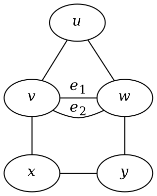

**Solution**

$$
V(G) = \{u, v, w, x, y\} \\
E(G) = \{uv, uw, e_1, e_2, vx, wy, xy\} \\
v(G) = 5 \\
e(G) = 7
$$

---

**Question 1.2.3.** Let $H$ be the graph with $V(H) = \{a,b,c,x,y,z\}$ and $E(H) = \{ab, ay, bx, by, cx, cz, xz, yz\}$. Find $v(H)$ and $e(H)$, and draw a diagram of $H$.

**Solution**
$v(H) = 6$
$e(H) = 8$

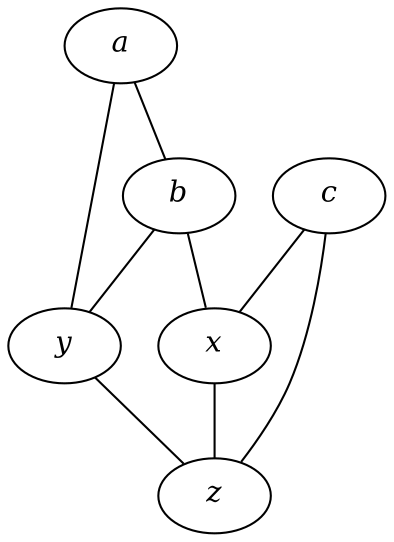

---

**Question 1.2.4** Let $G$ be the multigraph shown below.

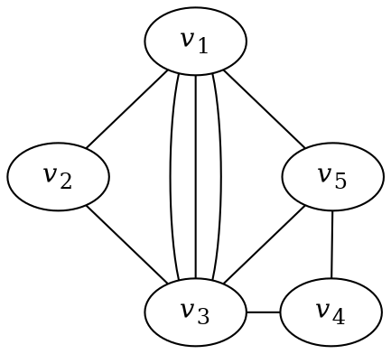

$(i)\>$ Find $A(G)$
$(ii)\>$ Is $A(G)$ symmetric (i.e., $(i,j)$-entry = $(j,i)$=entry)?
$(iii)\>$ What is the sum of the values of the entries in each row (respectively, column)?
$(iv)\>$ What is your interpretation of the 'sum' obtained in $(iii)$?

**Solution**

$(i)$

$$
A(G) = \begin{pmatrix}
0 & 1 & 3 & 0 & 1 \\
1 & 0 & 1 & 0 & 0 \\
3 & 1 & 0 & 1 & 1 \\
0 & 0 & 1 & 0 & 1 \\
1 & 0 & 1 & 1 & 0
\end{pmatrix}
$$

$(ii)\>$ Yes, $A(G)$ is symmetric.
$(iii)\>$ $5, 2, 6, 2, 3$
$(iv)\>$ The sum of the values of the entries in each row corresponds to the total number of edges that vertex is incident with.

---

**Question 1.2.5** The adjacency matrix of a multigraph $G$ is given below:

$$
A = \begin{pmatrix}
    0 & 2 & 1 & 0 & 1 \\
    2 & 0 & 1 & 0 & 0 \\
    1 & 1 & 0 & 3 & 2 \\
    0 & 0 & 3 & 0 & 0 \\
    1 & 0 & 2 & 0 & 0 \\
\end{pmatrix}
$$

Draw a diagram of $G$
**Solution**

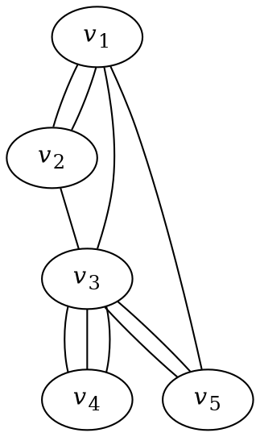

---

## **Exercise 1.2**

(1) Let $G$ be the multigraph representing the following diagram. Determine $V(G)$, $E(G)$, $v(G)$, and $e(G)$. Is $G$ a simple graph?

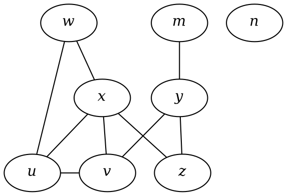

**Solution**

$$
V(G) = \{w, m, n, x, y, u, v, z\} \\
E(G) = \{ wu, wx, my, xu, xv, xz, yv, yz, uv \} \\
v(G) = 8\\
e(G) = 9
$$

$G$ is a simple graph.

---

(2) Draw the graph $G$ modeling the flight connectivity between twelve capital cities with the following vertex set $V(G)$ and edge set $E(G)$.

$$
\begin{aligned}
V(G) = &\{ \text{Asuncion}, \text{Beijing}, \text{Canberra},  \text{Dili}, \text{Havana}, \text{Kuala Lumpur}, \\
&\text{London}, \text{Nairobi}, \text{Phnom Penh}, \text{Singapore}, \text{Wellington}, \text{Zagreb} \}. \\
E(G) = &\{\text{Asuncion-London}, \text{Asuncion-Havana}, \text{Beijing-Canberra} \\
    &\text{Beijing-Kuala Lumpur}, \text{Beiijng-London}, \text{Beijing-Singapore} \\
    &\text{Beijing-Phnom Penh}, \text{Dili-Kuala Lumpur}, \text{Dili-Singapore} \\
    &\text{Dili-Canberra}, \text{Havana-London}, \text{London-Wellington} \\
    &\text{Kuala Lumpur-London}, \text{Kuala Lumpur-Phnom Penh} \\
    &\text{Kuala Lumpur-Singapore}, \text{Kuala Lumpur-Wellington} \\
    &\text{London-Nairobi}, \text{Phnom Penh-Singapore}, \text{London-Singapore} \\
    &\text{London-Zagreb}, \text{Singapore-Wellington}, \text{Havana-Nairobi}
 \}.
\end{aligned}
$$

(Note that you may use A to represent Asuncion, B to represent Beijing, C to represent Canberra, etc. )

**Solution**

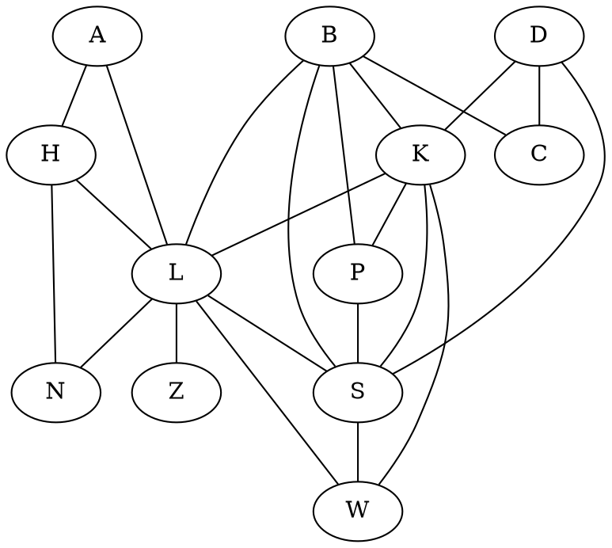

---

(3) Define a graph $G$ such that $V(G) = \{ 2, 3, 4, 5, 11, 12, 13, 14 \}$ and two vertices $s$ and $t$ are adjacent if and only if $\text{gcd}\{s, t\} = 1$. Draw a diagram of $G$ and find its size $e(G)$.

**Solution**
First we draw the graph $G$

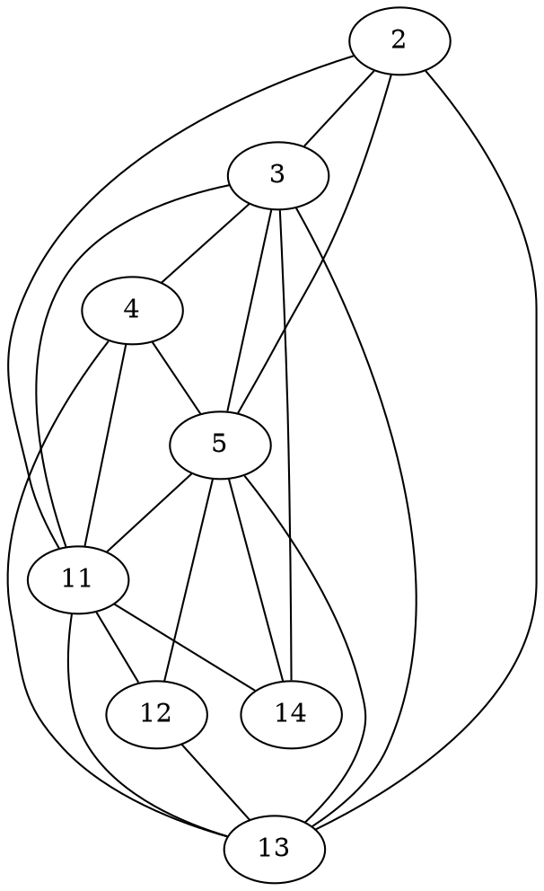

To find $e(G)$ we simply count all the edges.

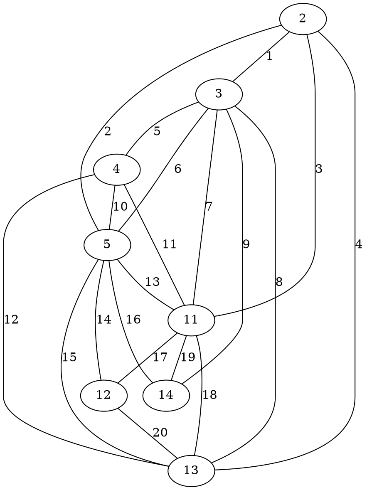

We conclude that $e(G) = 20$.

---

(4) The following diagram is a map of the road system in a town. Draw a multigraph to model the road system, using a vertex to represent a junction and an edge to represent a road joining two junctions.
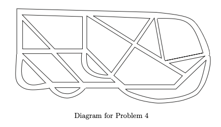

**Solution**
Start by labeling all the junctions

Here's the graph

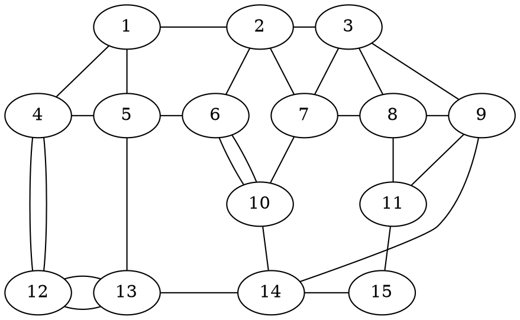

---

(5) Let $G$ be a graph with $V(G) = \{1, 2, \cdots, 10\}$, such that two numbers $i$ and $j$ in $V(G)$ are adjacent if and only if $|i - j| \leq 3$. Draw the graph $G$ and determine $e(G)$.

**Solution**
First draw the graph $G$. Note that the author uses the term "graph" to refer to a simple graph.

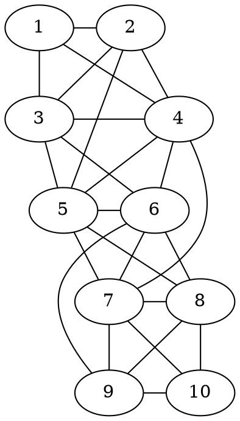

Next label all the edges

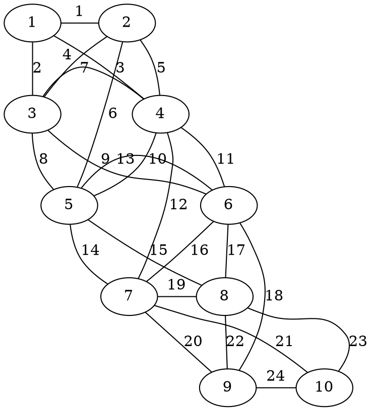

$$
e(G) = 24
$$

---

(6) Let $G$ be a graph with $V(G) = \{1, 2, \cdots, 10\}$, such that two numbers $i$ and $j$ in $V(G)$ are adjacent if and only if $i + j$ is a multiple of $4$. Draw the graph $G$ and determine $e(G)$.

**Solution**

First we draw $G$

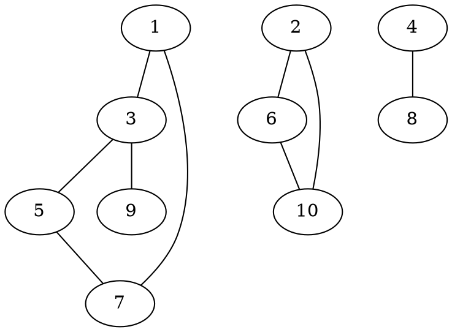

Next label the edges

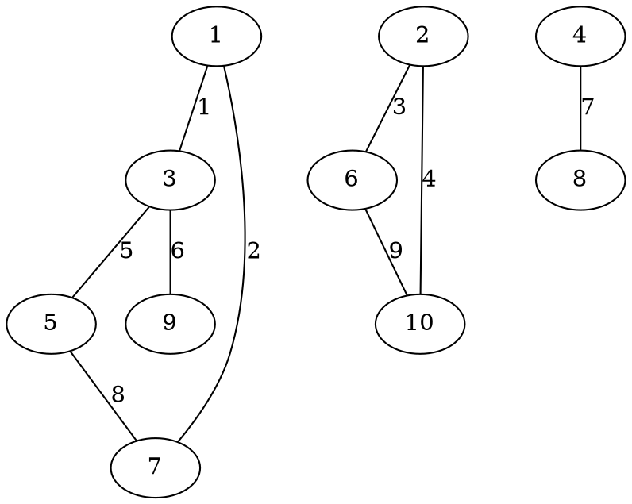

$$
e(G) = 9
$$

---

(7) Let $G$ be a graph with $V(G) = \{1, 2, \cdots, 10\}$, such that two numbers $i$ and $j$ in $V(G)$ are adjacent if and only if $i \times j$ is a multiple of $10$. Draw the graph $G$ and determine $e(G)$.

**Solution**

First we draw the graph $G$

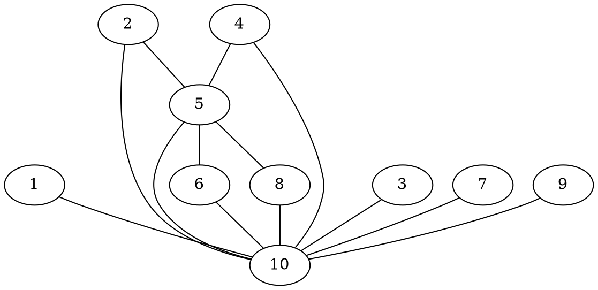

Next count the edges

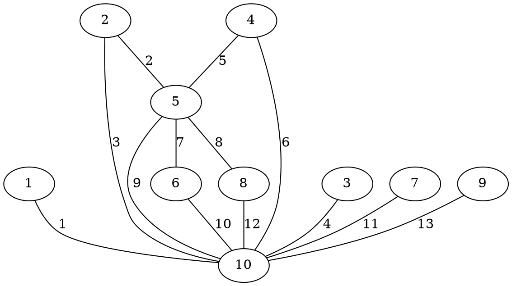

$$
e(G) = 13
$$

---

(8) Find the adjacency matrix of the following graph $G$.

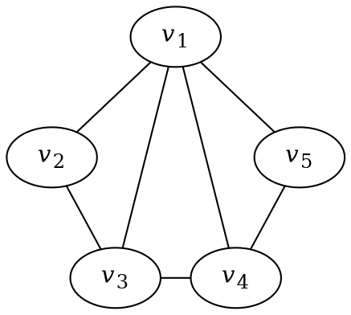

**Solution**

$$
A(G) =
\begin{pmatrix}
0 & 1 & 1 & 1 & 1 \\
1 & 0 & 1 & 0 & 0 \\
1 & 1 & 0 & 1 & 0 \\
1 & 0 & 1 & 0 & 1 \\
1 & 0 & 0 & 1 & 0
\end{pmatrix}
$$

---

(9) The adjacency matrix of a multigraph $G$ is shown below:

$$
\begin{pmatrix}
    0 & 1 & 0 & 2 & 3 \\
    1 & 0 & 1 & 2 & 2 \\
    0 & 1 & 0 & 1 & 1 \\
    2 & 2 & 1 & 0 & 1 \\
    3 & 2 & 1 & 1 & 0
\end{pmatrix}
$$

Draw a diagram of $G$

**Solution**

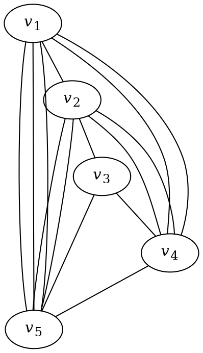

---

(10) Four teams of three specialist soldiers each (a scout, a signaler and a sniper) are to be sent into enemy territory. However, some of the soldiers cannot work will with some others. The following table shows the soldiers, their specializations and who they cannot work with.

| Solider | Specialization | Cannot cooperate with |
| ------- | -------------- | --------------------- |
| 1       | Scout          | 5, 7, 10              |
| 2       | Scout          | -                     |
| 3       | Scout          | 5, 6, 8, 9, 11        |
| 4       | Scout          | 8, 12                 |
| 5       | Signaler       | 1, 3, 9               |
| 6       | Signaler       | 3, 10, 11             |
| 7       | Signaler       | 1, 9, 12              |
| 8       | Signaler       | 3, 4, 9, 10           |
| 9       | Sniper         | 3, 5, 7, 8            |
| 10      | Sniper         | 1, 6, 8               |
| 11      | Sniper         | 3, 6                  |
| 12      | Sniper         | 4, 7                  |

(i) Draw a multigraph to model the situation so that we may see how to form 3-man teams such that each specialization is represented and every member of the team can work with every other. State clearly what the vertices represent and under what condition(s) two vertices are joined by an edge.

(ii) Can you form four 3-man teams such that each specialization if represented and all members of the teams can work with one another?

**Solution**
(i) Let each vertex represent a solider, and join two vertices by an edge if they can work together. This means that they must be of different specializations and not be on the "cannot cooperate with" section.

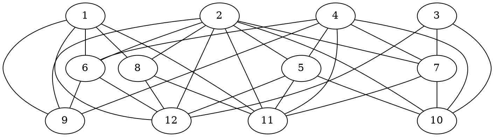

(ii) From the diagram we can clearly see four 3-man teams that work:

$$
\{1, 6, 9\}, \{2, 8, 12\}, \{4, 5, 11\}, \{3, 7, 10\}
$$

---

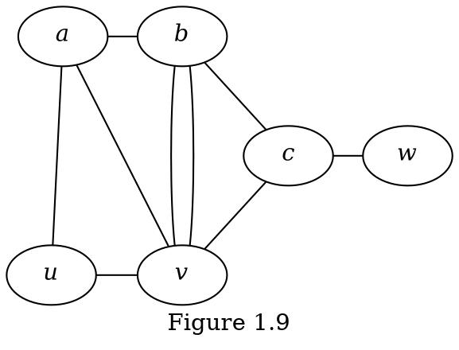

**Question 1.3.1**
(i) Find the degree of each vertex in $G$ of Figure 1.9.
(ii) Find $N(x)$ for each vertex $x$ in $G$ of Figure 1.9.
(iii) By definition, is it true that $d(v) = |N(v)|$?

**Solution**
(i)

$$
d(a) = 3 \\
d(b) = 4 \\
d(c) = 3 \\
d(u) = 2 \\
d(v) = 5 \\
d(w) = 1
$$

(ii)

$$
N(a) = \{u, v, b\} \\
N(b) = \{a, v, c\} \\
N(c) = \{b, v, w\} \\
N(u) = \{a, v\} \\
N(v) = \{a, b, c, u\} \\
N(w) = \{c\}
$$

(iii) It is not always true that $d(v) = |N(v)|$. For example $d(v) = 5$ but $|N(v)| = 4$. This happens because of multiple edges- there are two $bv$ edges but because sets don't allow duplications $N(v)$ only contains $b$ once.

---

**Question 1.3.2** &nbsp; Consider the multigraph $G$ of Figure 1.9. Find $e(G)$ and the sum of the degrees of the six vertices. Is the sum twice of $e(G)$?
&nbsp; &nbsp; In general, is the sum of the degrees of the vertices in a multigraph always double its size?

**Solution**
To find $e(G)$ simply label the edges

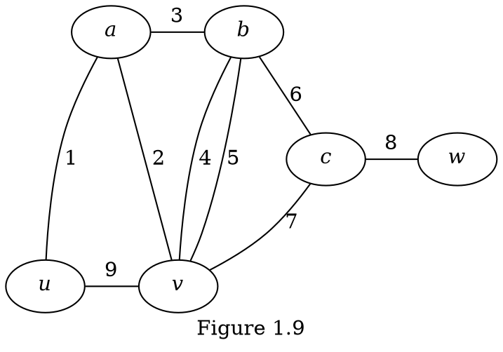

So clearly $e(G) = 9$. Next we find the sum of the degrees of the six vertices.

$$
\begin{aligned}
\sum_{v \in V(G)} d(v) &= d(a) + d(b) + d(c) + d(u) + d(v) + d(w)  \\
&= 3 + 4 + 3 + 2 + 5 + 1 = 18
\end{aligned}
$$

Here we have $\sum_{v \in V(G)} d(v) = 2 e(G)$ and by the Handshaking Lemma this holds in general.

---

```dot
graph {
    label = "Figure 1.10"
    node [ordering=out]
    {
        j
        p
    }
    {
        rank = same
        a
        z
    }
    {
        rank = same
        b
        y
    }
    a -- x

    b -- x
    b -- c

    c -- x
    c -- y

    w -- x
    w -- x
    w -- y
    w -- z

    x -- y
    x -- z

    y -- z
}
```

**Question 1.3.3** &nbsp; &nbsp; (1) How many odd vertices are there in each of the multigraphs in the previous examples?
(2) Can you construct a multigraph containing
&nbsp; &nbsp; (i) exactly one odd vertex?
&nbsp; &nbsp; (ii) exactly three odd vertices?

**Solution**

(1) First let's take a look at Figure 1.10 and plot the vertices and their respective degrees:

| Vertex | Degree |
| ------ | ------ |
| $a$    | 1      |
| $b$    | 2      |
| $c$    | 3      |
| $j$    | 0      |
| $p$    | 0      |
| $w$    | 4      |
| $x$    | 7      |
| $y$    | 4      |
| $z$    | 3      |

We can see from this table that four vertices, $a$, $c$, $x$, and $z$, have odd degree.

Next let's take a look at Figure 1.9, pictured again here

```dot
graph {
    label = "Figure 1.9"
    node [ordering=out]

    {
        rank = same
        a [label=<<i>a</i>>]
        b [label=<<i>b</i>>]
    }
    {
        rank = same
        c [label=<<i>c</i>>]
        w [label=<<i>w</i>>]
    }
    {
        rank = same
        u [label=<<i>u</i>>]
        v [label=<<i>v</i>>]
    }

    a -- u
    a -- v
    a -- b

    b -- v
    b -- v
    b -- c

    c -- v
    c -- w

    u -- v
}
```

Let's make a table of the vertices and their degrees

| Vertex | Degree |
| ------ | ------ |
| $a$    | 3      |
| $b$    | 4      |
| $c$    | 3      |
| $u$    | 2      |
| $v$    | 5      |
| $w$    | 1      |

We can see from this table that four vertices, $a$, $c$, $v$, and $w$, have odd degree.

(2) No for both (i) and (ii) because one and three are odd numbers, and you must have an even number of vertices with odd degree.

---

**Question 1.3.4.** &nbsp; &nbsp; Construct a $5$-regular graph of order $10$. What is its size?

**Solution**

```dot
graph {
    {
        rank = same
        1
        2
        3
        4
        5
        1 -- 2 -- 3 -- 4 -- 5 [style=invis]
    }
    {
        rank = same
        6
        7
        8
        9
        10
        6 -- 7 -- 8 -- 9 -- 10 [style=invis]
    }
    1 -- 6
    1 -- 7
    1 -- 8
    1 -- 9
    1 -- 10

    2 -- 6
    2 -- 7
    2 -- 8
    2 -- 9
    2 -- 10

    3 -- 6
    3 -- 7
    3 -- 8
    3 -- 9
    3 -- 10

    4 -- 6
    4 -- 7
    4 -- 8
    4 -- 9
    4 -- 10

    5 -- 6
    5 -- 7
    5 -- 8
    5 -- 9
    5 -- 10
}
```

Of course its size is $50$ because it has $10$ nodes each of which is incident with $5$ edges.

---

Among the (simple) graphs $G$ of a fixed order $n$, at one extreme, the null graph $N_n$ contains no edges (the least possible size). At the other extreme, we may ask:

**Question 1.3.5.** &nbsp; &nbsp; What is the largest possible size that $G$ can have? Which graph has its size attaining this largest possible number?

**Solution**

The largest possible size that $G$ can have is $n + (n-1) + \cdot + 0 = \frac{n(n-1)}{2}$, which happens when each vertex is adjacent to every other vertex.

---

## Exercise 1.3

$(1) \>$ In the following multigraph $G$, find
$\quad (i) \>$ the size of $G$,
$\quad (ii) \>$ the degree of each vertex,
$\quad (iii) \>$ the sum $\sum \{ d(v) | v \in V(G) \}$,
$\quad (iv) \>$ the number of odd vertices,
$\quad (v) \>$ $\Delta(G)$, and
$\quad (vi) \>$ $\delta(G)$.

```dot
graph {
    node [ordering=out]
    {
        rank = same
        a [label=<<i>a</i>>]
        e [label=<<i>e</i>>]
        g [label=<<i>g</i>>]
    }
    {
        rank = same
        b [label=<<i>b</i>>]
        w [label=<<i>w</i>>]
        y [label=<<i>y</i>>]
        b -- w -- y [style=invis]
    }
    {
        rank = same
        c [label=<<i>c</i>>]
        x [label=<<i>x</i>>]
        z [label=<<i>z</i>>]
    }
    a -- b
    a -- c
    a -- c
    a -- x
    a -- e

    b -- e
    b -- c

    c -- e
    c -- y

    e -- y
    e -- z
    e -- g

    g -- y
}
```

Is your answer for $(iii)$ double your answer for $(i)$? Is your answer for $(iv)$ an even number?

**Solution**

$(i) \>$ To find the size of $G$ we count all the edges

```dot
graph {
    node [ordering=out]
    {
        rank = same
        a [label=<<i>a</i>>]
        e [label=<<i>e</i>>]
        g [label=<<i>g</i>>]
    }
    {
        rank = same
        b [label=<<i>b</i>>]
        w [label=<<i>w</i>>]
        y [label=<<i>y</i>>]
        b -- w -- y [style=invis]
    }
    {
        rank = same
        c [label=<<i>c</i>>]
        x [label=<<i>x</i>>]
        z [label=<<i>z</i>>]
    }
    a -- b [label=1]
    a -- c [label=2]
    a -- c [label=3]
    a -- x [label=4]
    a -- e [label=5]

    b -- e [label=6]
    b -- c [label=7]

    c -- e [label=8]
    c -- y [label=9]

    e -- y [label=10]
    e -- z [label=11]
    e -- g [label=12]

    g -- y [label=13]
}
```

Clearly $e(G) = 13$.

$(ii) \>$ Let's make a table to see the degree of each vertex

| Vertex | Degree |
| ------ | ------ |
| $a$    | 5      |
| $b$    | 3      |
| $c$    | 5      |
| $e$    | 6      |
| $g$    | 2      |
| $w$    | 0      |
| $x$    | 1      |
| $y$    | 3      |
| $z$    | 1      |

$(iii) \>$ Simply add the degree column to get the sum of the degrees

$$
5 + 3 + 5 + 6 + 2 + 0 + 1 + 3 + 1 = 26
$$

$(iv) \>$ The odd vertices are $a$, $b$, $c$, $x$, $y$, $z$, so there are $6$ odd vertices.

$(v) \>$ The highest degree vertex is $e$ with a degree of $6$ so $\Delta(G) = 6$.

$(vi) \>$ The lowest degree vertex is $w$ with a degree of $0$ so $\delta(G) = 0$.

The answer to $(iii)$ is double the answer of $(i)$ and the answer for $(iv)$ is an even number.

---

$(2) \>$ Construct a multigraph of order $6$ and size $7$ in which every vertex is odd.

**Solution**

```dot
graph {
    {
        rank = same
        1
        2
        3
        1 -- 2 -- 3 [style=invis]
    }
    {
        rank = same
        4
        5
        6
        4 -- 5 -- 6 [style=invis]
    }
    1 -- 4
    1 -- 4
    1 -- 4

    2 -- 5
    2 -- 5
    2 -- 5

    3 -- 6
}
```

---

$(3) \>$ Let $G$ be a multigraph with $V(G) = \{v_1, v_2, \cdots, v_n\}$. Prove that the sum of all the entries in the $i$th row of the adjacency matrix $A(G)$ is the degree of the vertex $v_i$ for each $i = 1, 2, \cdots, n$.

**Solution**

$$
\sum_{j=1}^n a_{i,j} = \sum_{j=1}^n \text{\# edges joining } v_i \text{ and } v_j = d(v_i)
$$

---

$(4) \>$ Let $G$ be a graph of order $8$ and size $15$ in which each vertex is of degree $3$ or $5$. How many vertices of degree $5$ does $G$ have? Construct one such graph $G$.

**Solution**
Here is one such graph

```dot
graph {
    {
        rank = same
        1
        2
        3
        4
    }
    {
        rank = same
        5
        6
        7
        8
    }
    1 -- 2
    1 -- 4
    1 -- 4
    1 -- 6
    1 -- 8

    2 -- 3
    2 -- 6

    3 -- 4
    3 -- 6

    4 -- 5
    4 -- 7

    5 -- 6
    5 -- 8

    6 -- 7

    7 -- 8
}
```

We can check that it is size $15$ by counting the edges

```dot
graph {
    {
        rank = same
        1
        2
        3
        4
    }
    {
        rank = same
        5
        6
        7
        8
    }
    1 -- 2 [label=1]
    1 -- 4 [label=2]
    1 -- 4 [xlabel=3]
    1 -- 6 [label=4]
    1 -- 8 [label=5]

    2 -- 3 [label=6]
    2 -- 6 [label=7]

    3 -- 4 [label=8]
    3 -- 6 [label=9]

    4 -- 5 [label=10]
    4 -- 7 [label=11]

    5 -- 6 [label=12]
    5 -- 8 [label=13]

    6 -- 7 [label=14]

    7 -- 8 [label=15]
}
```

or by observing that the adjacency matrix is

$$
A(G) = \begin{pmatrix}
    0 & 1 & 0 & 2 & 0 & 1 & 0 & 1 \\
    1 & 0 & 1 & 0 & 0 & 1 & 0 & 0 \\
    0 & 1 & 0 & 1 & 0 & 1 & 0 & 0  \\
    2 & 0 & 1 & 0 & 1 & 0 & 1 & 0 \\
    0 & 0 & 0 & 1 & 0 & 1 & 0 & 1 \\
    1 & 1 & 1 & 0 & 1 & 0 & 1 & 0 \\
    0 & 0 & 0 & 1 & 0 & 1 & 0 & 1 \\
    1 & 0 & 0 & 0 & 1 & 0 & 1 & 0 \\
\end{pmatrix}
$$

And so the sum of each row / column is

$$
r_1 = 1 + 2 + 1 + 1 = 5 \\
r_2 = 1 + 1 + 1 = 3 \\
r_3 = 1 + 1 + 1 = 3 \\
r_4 = 2 + 1 + 1 + 1 = 5 \\
r_5 = 1 + 1 + 1 = 3 \\
r_6 = 1 + 1 + 1 + 1 + 1 = 5 \\
r_7 = 1 + 1 + 1 = 3 \\
r_8 = 1 + 1 + 1 = 3
$$

(note that this shows that the degree of each vertex is either $3$ or $5$ as desired)

We can add these up to get

$$
r_1 + r_2 + r_3 + r_4 + r_5 + r_6 + r_7 + r_8 = 5 + 3 + 3 + 5 + 3 + 5 + 3 + 3 = 30
$$

This must be double the number of edges, so we conclude that $e(G) = 15$.

Finally, since $r_1$, $r_4$, and $r_6$ sum up to 5, vertices $1$, $4$, and $6$ have degree five, so our $G$ has $3$ vertices of degree five.

Now, why must all graphs $G$ have $3$ vertices of degree five? Well know that $G$ is of order $8$ and size $15$ so by the Handshaking Lemma

$$
\sum_{i=1}^8 d(v_i) = 2 \times 15 = 30
$$

We also know that each vertex is degree $3$ or $5$. Let $A$ be the set of vertices of degree $3$ and $B$ be the set of vertices with degree $5$. Then

$$
30 = \sum_{v \in A} d(v) + \sum_{v \in B} d(v) = 3 |A| + 5 |B|
$$

Of course since we are order $8$ and every vertex is in $A$ or $B$ but not both so $V(G) = A \sqcup B $, that is the union is disjoint so

$$
|A| + |B| = 8
$$

Plugging in,

$$
30 = 3|A| + 5 (8 - |A|) = 40 - 2 |A| \\
|A| = 5 \\
|B| = 8 - |A| = 3. \quad \square
$$

---

$(5) \>$ Let $H$ be a graph of order $10$ such that $3 \leq d(v) \leq 5$ for each vertex $v$ in $H$. Not every vertex is even. No two odd vertices are of the same degree. What is the size of $H$?

**Solution**
By the Handshaking Lemma we have

$$
\sum_{v \in V(H)} d(v) = 2 e(H)
$$

It would be impossible to have one vertex be degree $3$ and the rest be even because then we would have

$$
2e(H) = 3 + 9 \times 4 = 39
$$

Similarly, it would be impossible to have one vertex be degree $5$ and the rest be even because then we would have

$$
2e(H) = 5 + 9 \times 4 = 41
$$

We conclude that we must have on degree $3$ vertex, one degree $5$ vertex, and that the rest are even. So we calculate that

$$
2 e(H) = 3 + 5 + 8 \times 4 = 40 \\
e(H) = 20. \quad \square
$$

---

$(6) \>$ Let $G$ be a graph of order $14$ and size $30$ in which every vertex is of degree $4$ or $5$. How many vertices of degree $5$ does $G$ have? Construct one such graph $G$.

**Solution**
Let $A$ be the set of vertices that are degree $5$. By the Handshaking Lemma,

$$
\begin{aligned}
2 \times 30 &= \sum_{v \in A} d(v) + \sum_{v \notin A} d(v) = 5 \times |A| + 4 \times (14 - |A|) \\
&= 56 + |A|
\end{aligned} \\
|A| = 4. \quad \square
$$

Here is one such graph

```dot
graph {
    {
        rank = same
        1
        2
        3
        4
        1 -- 2 -- 3 -- 4 [style=invis]
    }
    {
        rank = same
        5
        6
        7
        8
        9
        5 -- 6 -- 7 -- 8 -- 9 [style=invis]
    }
    {
        rank = same
        10
        11
        12
        10 -- 11 -- 12  [style=invis]
    }
    {
        rank = same
        13
        14
        13 -- 14 [style=invis]
    }
    1 -- 5
    1 -- 6
    1 -- 7
    1 -- 8
    1 -- 9

    2 -- 5
    2 -- 6
    2 -- 7
    2 -- 8
    2 -- 9

    3 -- 5
    3 -- 6
    3 -- 7
    3 -- 8
    3 -- 9

    4 -- 5
    4 -- 6
    4 -- 7
    4 -- 8
    4 -- 9

    10 -- 11
    10 -- 12
    10 -- 13
    10 -- 14

    11 -- 12
    11 -- 13
    11 -- 14

    12 -- 13
    12 -- 14

    13 -- 14

}
```

Let's check the degrees of each vertex

| Vertex | Degree |
| ------ | ------ |
| $1$    | 5      |
| $2$    | 5      |
| $3$    | 5      |
| $4$    | 5      |
| $5$    | 4      |
| $6$    | 4      |
| $7$    | 4      |
| $8$    | 4      |
| $9$    | 4      |
| $10$   | 4      |
| $11$   | 4      |
| $12$   | 4      |
| $13$   | 4      |
| $14$   | 4      |

Clearly exactly four vertices are degree $5$ and the rest are degree $4$, and the sum of their degree is $60$, so we know that the size of $G$ is $30$.

---

$(7) \>$ Does there exist a multigraph $G$ of order $8$ such that $\delta(G) = 0$ while $\Delta(G) = 7$? What if "multigraph $G$" is replaced by "graph $G$"?

**Solution**
Here is one such multigraph $G$:

```dot
graph {
    {
        1
    }
    2 -- 3
    2 -- 3
    2 -- 4
    2 -- 5
    2 -- 6
    2 -- 7
    2 -- 8

}
```

However, no such simple graph can exist. As you can see we need the double edge connection $2$ and $3$ to get the vertex count up to $7$. There are only $8$ total vertices, so if one vertex connects to every other vertex that would be $7$ connections, but it must not connect to one of the vertices because one of the vertices must have degree $0$ because $\delta(G) = 0$. $\quad \square$

---
