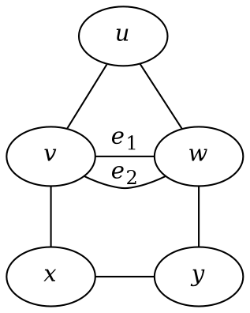

---
export_on_save:
  html: true
---

**Question 1.2.2** Let $G$ be the multigraph shown below. Find $V(G)$, $E(G)$, $v(G)$, and $e(G)$.

**Solution**

$$
V(G) = \{u, v, w, x, y\} \\
E(G) = \{uv, uw, e_1, e_2, vx, wy, xy\} \\
v(G) = 5 \\
e(G) = 7
$$

---
