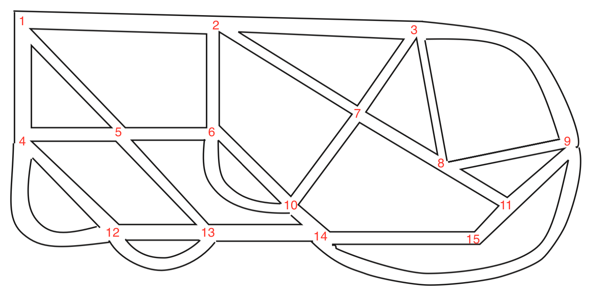

---
export_on_save:
  html: true
---

<style>
.katex-display { overflow: auto hidden }
p.dot { display: flex; justify-content: center; }
img {display: block; margin: 0 auto;}
</style>

**Question 1.2.2** Let $G$ be the multigraph shown below. Find $V(G)$, $E(G)$, $v(G)$, and $e(G)$.


**Solution**

$$
V(G) = \{u, v, w, x, y\} \\
E(G) = \{uv, uw, e_1, e_2, vx, wy, xy\} \\
v(G) = 5 \\
e(G) = 7
$$

---

**Question 1.2.3.** Let $H$ be the graph with $V(H) = \{a,b,c,x,y,z\}$ and $E(H) = \{ab, ay, bx, by, cx, cz, xz, yz\}$. Find $v(H)$ and $e(H)$, and draw a diagram of $H$.

**Solution**
$v(H) = 6$
$e(H) = 8$


---

**Question 1.2.4** Let $G$ be the multigraph shown below.


$(i)\>$ Find $A(G)$
$(ii)\>$ Is $A(G)$ symmetric (i.e., $(i,j)$-entry = $(j,i)$=entry)?
$(iii)\>$ What is the sum of the values of the entries in each row (respectively, column)?
$(iv)\>$ What is your interpretation of the 'sum' obtained in $(iii)$?

**Solution**

$(i)$

$$
A(G) = \begin{pmatrix}
0 & 1 & 3 & 0 & 1 \\
1 & 0 & 1 & 0 & 0 \\
3 & 1 & 0 & 1 & 1 \\
0 & 0 & 1 & 0 & 1 \\
1 & 0 & 1 & 1 & 0
\end{pmatrix}
$$

$(ii)\>$ Yes, $A(G)$ is symmetric.
$(iii)\>$ $5, 2, 6, 2, 3$
$(iv)\>$ The sum of the values of the entries in each row corresponds to the total number of edges that vertex is incident with.

---

**Question 1.2.5** The adjacency matrix of a multigraph $G$ is given below:

$$
A = \begin{pmatrix}
    0 & 2 & 1 & 0 & 1 \\
    2 & 0 & 1 & 0 & 0 \\
    1 & 1 & 0 & 3 & 2 \\
    0 & 0 & 3 & 0 & 0 \\
    1 & 0 & 2 & 0 & 0 \\
\end{pmatrix}
$$

Draw a diagram of $G$
**Solution**


---

## **Exercise 1.2**

(1) Let $G$ be the multigraph representing the following diagram. Determine $V(G)$, $E(G)$, $v(G)$, and $e(G)$. Is $G$ a simple graph?


**Solution**

$$
V(G) = \{w, m, n, x, y, u, v, z\} \\
E(G) = \{ wu, wx, my, xu, xv, xz, yv, yz, uv \} \\
v(G) = 8\\
e(G) = 9
$$

$G$ is a simple graph.

---

(2) Draw the graph $G$ modeling the flight connectivity between twelve capital cities with the following vertex set $V(G)$ and edge set $E(G)$.

$$
\begin{aligned}
V(G) = &\{ \text{Asuncion}, \text{Beijing}, \text{Canberra},  \text{Dili}, \text{Havana}, \text{Kuala Lumpur}, \\
&\text{London}, \text{Nairobi}, \text{Phnom Penh}, \text{Singapore}, \text{Wellington}, \text{Zagreb} \}. \\
E(G) = &\{\text{Asuncion-London}, \text{Asuncion-Havana}, \text{Beijing-Canberra} \\
    &\text{Beijing-Kuala Lumpur}, \text{Beiijng-London}, \text{Beijing-Singapore} \\
    &\text{Beijing-Phnom Penh}, \text{Dili-Kuala Lumpur}, \text{Dili-Singapore} \\
    &\text{Dili-Canberra}, \text{Havana-London}, \text{London-Wellington} \\
    &\text{Kuala Lumpur-London}, \text{Kuala Lumpur-Phnom Penh} \\
    &\text{Kuala Lumpur-Singapore}, \text{Kuala Lumpur-Wellington} \\
    &\text{London-Nairobi}, \text{Phnom Penh-Singapore}, \text{London-Singapore} \\
    &\text{London-Zagreb}, \text{Singapore-Wellington}, \text{Havana-Nairobi}
 \}.
\end{aligned}
$$

(Note that you may use A to represent Asuncion, B to represent Beijing, C to represent Canberra, etc. )

**Solution**


---

(3) Define a graph $G$ such that $V(G) = \{ 2, 3, 4, 5, 11, 12, 13, 14 \}$ and two vertices $s$ and $t$ are adjacent if and only if $\text{gcd}\{s, t\} = 1$. Draw a diagram of $G$ and find its size $e(G)$.

**Solution**
First we draw the graph $G$


To find $e(G)$ we simply count all the edges.


We conclude that $e(G) = 20$.

---

(4) The following diagram is a map of the road system in a town. Draw a multigraph to model the road system, using a vertex to represent a junction and an edge to represent a road joining two junctions.


**Solution**
Start by labeling all the junctions

Here's the graph


---

(5) Let $G$ be a graph with $V(G) = \{1, 2, \cdots, 10\}$, such that two numbers $i$ and $j$ in $V(G)$ are adjacent if and only if $|i - j| \leq 3$. Draw the graph $G$ and determine $e(G)$.

**Solution**
First draw the graph $G$. Note that the author uses the term "graph" to refer to a simple graph.


Next label all the edges


$$
e(G) = 24
$$

---

(6) Let $G$ be a graph with $V(G) = \{1, 2, \cdots, 10\}$, such that two numbers $i$ and $j$ in $V(G)$ are adjacent if and only if $i + j$ is a multiple of $4$. Draw the graph $G$ and determine $e(G)$.

**Solution**

First we draw $G$


Next label the edges


$$
e(G) = 9
$$

---

(7) Let $G$ be a graph with $V(G) = \{1, 2, \cdots, 10\}$, such that two numbers $i$ and $j$ in $V(G)$ are adjacent if and only if $i \times j$ is a multiple of $10$. Draw the graph $G$ and determine $e(G)$.

**Solution**

First we draw the graph $G$


Next count the edges


$$
e(G) = 13
$$

---

(8) Find the adjacency matrix of the following graph $G$.


**Solution**

$$
A(G) =
\begin{pmatrix}
0 & 1 & 1 & 1 & 1 \\
1 & 0 & 1 & 0 & 0 \\
1 & 1 & 0 & 1 & 0 \\
1 & 0 & 1 & 0 & 1 \\
1 & 0 & 0 & 1 & 0
\end{pmatrix}
$$

---

(9) The adjacency matrix of a multigraph $G$ is shown below:

$$
\begin{pmatrix}
    0 & 1 & 0 & 2 & 3 \\
    1 & 0 & 1 & 2 & 2 \\
    0 & 1 & 0 & 1 & 1 \\
    2 & 2 & 1 & 0 & 1 \\
    3 & 2 & 1 & 1 & 0
\end{pmatrix}
$$

Draw a diagram of $G$

**Solution**


---

(10) Four teams of three specialist soldiers each (a scout, a signaler and a sniper) are to be sent into enemy territory. However, some of the soldiers cannot work will with some others. The following table shows the soldiers, their specializations and who they cannot work with.

| Solider | Specialization | Cannot cooperate with |
| ------- | -------------- | --------------------- |
| 1       | Scout          | 5, 7, 10              |
| 2       | Scout          | -                     |
| 3       | Scout          | 5, 6, 8, 9, 11        |
| 4       | Scout          | 8, 12                 |
| 5       | Signaler       | 1, 3, 9               |
| 6       | Signaler       | 3, 10, 11             |
| 7       | Signaler       | 1, 9, 12              |
| 8       | Signaler       | 3, 4, 9, 10           |
| 9       | Sniper         | 3, 5, 7, 8            |
| 10      | Sniper         | 1, 6, 8               |
| 11      | Sniper         | 3, 6                  |
| 12      | Sniper         | 4, 7                  |

(i) Draw a multigraph to model the situation so that we may see how to form 3-man teams such that each specialization is represented and every member of the team can work with every other. State clearly what the vertices represent and under what condition(s) two vertices are joined by an edge.

(ii) Can you form four 3-man teams such that each specialization if represented and all members of the teams can work with one another?

**Solution**
(i) Let each vertex represent a solider, and join two vertices by an edge if they can work together. This means that they must be of different specializations and not be on the "cannot cooperate with" section.


(ii) From the diagram we can clearly see four 3-man teams that work:

$$
\{1, 6, 9\}, \{2, 8, 12\}, \{4, 5, 11\}, \{3, 7, 10\}
$$

---


**Question 1.3.1**
(i) Find the degree of each vertex in $G$ of Figure 1.9.
(ii) Find $N(x)$ for each vertex $x$ in $G$ of Figure 1.9.
(iii) By definition, is it true that $d(v) = |N(v)|$?

**Solution**
(i)

$$
d(a) = 3 \\
d(b) = 4 \\
d(c) = 3 \\
d(u) = 2 \\
d(v) = 5 \\
d(w) = 1
$$

(ii)

$$
N(a) = \{u, v, b\} \\
N(b) = \{a, v, c\} \\
N(c) = \{b, v, w\} \\
N(u) = \{a, v\} \\
N(v) = \{a, b, c, u\} \\
N(w) = \{c\}
$$

(iii) It is not always true that $d(v) = |N(v)|$. For example $d(v) = 5$ but $|N(v)| = 4$. This happens because of multiple edges- there are two $bv$ edges but because sets don't allow duplications $N(v)$ only contains $b$ once.

---

**Question 1.3.2** &nbsp; Consider the multigraph $G$ of Figure 1.9. Find $e(G)$ and the sum of the degrees of the six vertices. Is the sum twice of $e(G)$?
&nbsp; &nbsp; In general, is the sum of the degrees of the vertices in a multigraph always double its size?

**Solution**
To find $e(G)$ simply label the edges


So clearly $e(G) = 9$. Next we find the sum of the degrees of the six vertices.

$$
\begin{aligned}
\sum_{v \in V(G)} d(v) &= d(a) + d(b) + d(c) + d(u) + d(v) + d(w)  \\
&= 3 + 4 + 3 + 2 + 5 + 1 = 18
\end{aligned}
$$

Here we have $\sum_{v \in V(G)} d(v) = 2 e(G)$ and by the Handshaking Lemma this holds in general.

---

```dot
graph {
    label = "Figure 1.10"
    node [ordering=out]
    {
        j
        p
    }
    {
        rank = same
        a
        z
    }
    {
        rank = same
        b
        y
    }
    a -- x

    b -- x
    b -- c

    c -- x
    c -- y

    w -- x
    w -- x
    w -- y
    w -- z

    x -- y
    x -- z

    y -- z
}
```

**Question 1.3.3** &nbsp; &nbsp; (1) How many odd vertices are there in each of the multigraphs in the previous examples?
(2) Can you construct a multigraph containing
&nbsp; &nbsp; (i) exactly one odd vertex?
&nbsp; &nbsp; (ii) exactly three odd vertices?

**Solution**

(1) First let's take a look at Figure 1.10 and plot the vertices and their respective degrees:

| Vertex | Degree |
| ------ | ------ |
| $a$    | 1      |
| $b$    | 2      |
| $c$    | 3      |
| $j$    | 0      |
| $p$    | 0      |
| $w$    | 4      |
| $x$    | 7      |
| $y$    | 4      |
| $z$    | 3      |

We can see from this table that four vertices, $a$, $c$, $x$, and $z$, have odd degree.

Next let's take a look at Figure 1.9, pictured again here

```dot
graph {
    label = "Figure 1.9"
    node [ordering=out]

    {
        rank = same
        a [label=<<i>a</i>>]
        b [label=<<i>b</i>>]
    }
    {
        rank = same
        c [label=<<i>c</i>>]
        w [label=<<i>w</i>>]
    }
    {
        rank = same
        u [label=<<i>u</i>>]
        v [label=<<i>v</i>>]
    }

    a -- u
    a -- v
    a -- b

    b -- v
    b -- v
    b -- c

    c -- v
    c -- w

    u -- v
}
```

Let's make a table of the vertices and their degrees

| Vertex | Degree |
| ------ | ------ |
| $a$    | 3      |
| $b$    | 4      |
| $c$    | 3      |
| $u$    | 2      |
| $v$    | 5      |
| $w$    | 1      |

We can see from this table that four vertices, $a$, $c$, $v$, and $w$, have odd degree.

(2) No for both (i) and (ii) because one and three are odd numbers, and you must have an even number of vertices with odd degree.

---

**Question 1.3.4.** &nbsp; &nbsp; Construct a $5$-regular graph of order $10$. What is its size?
